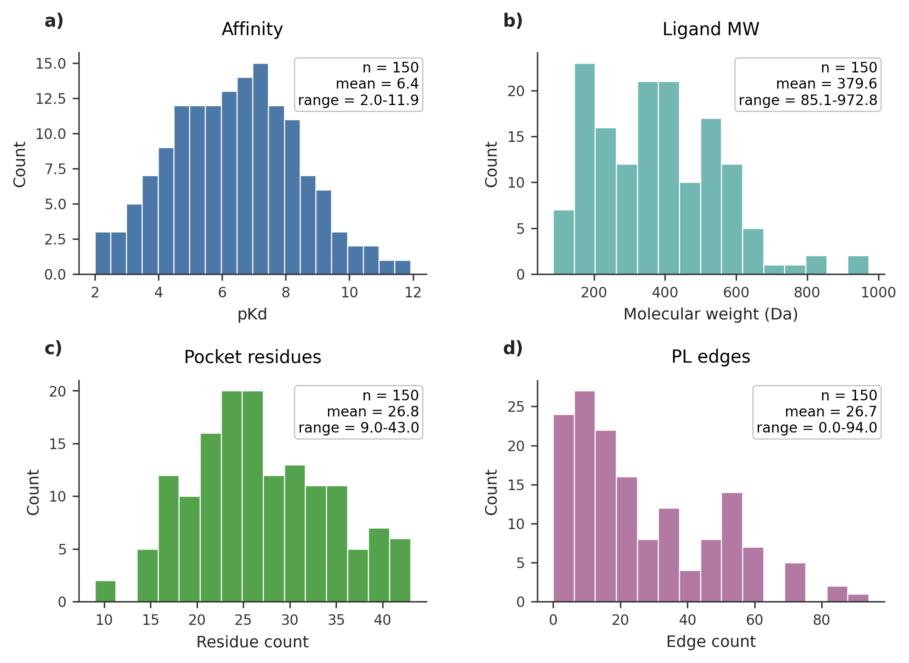
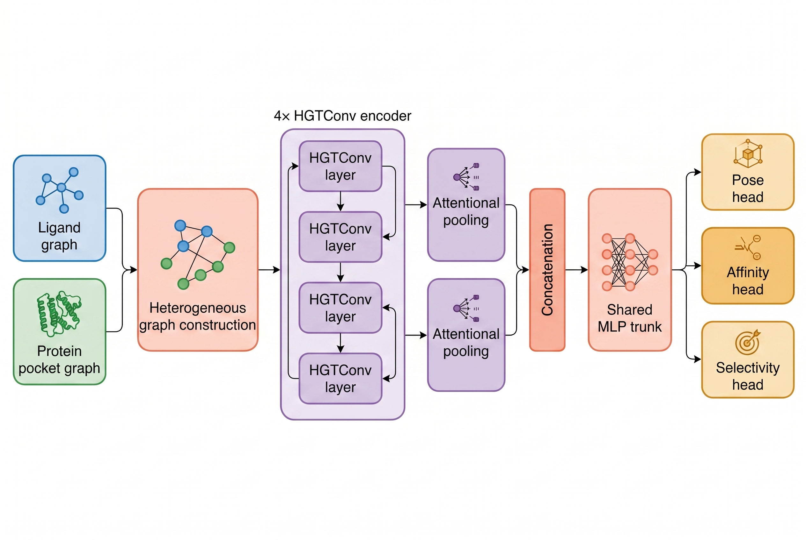
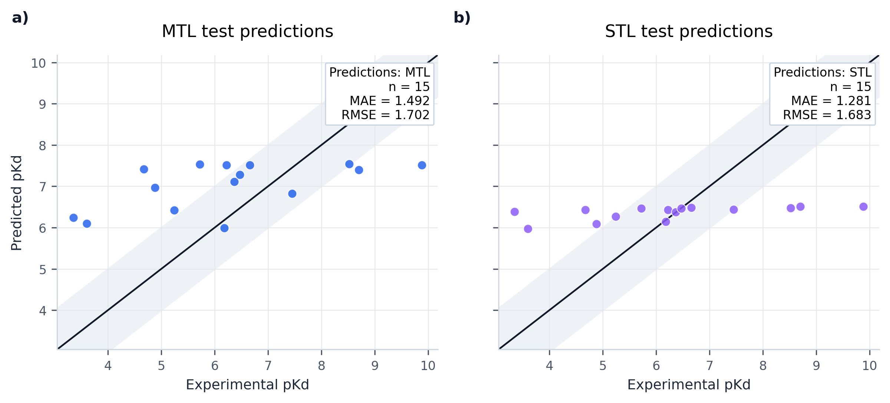
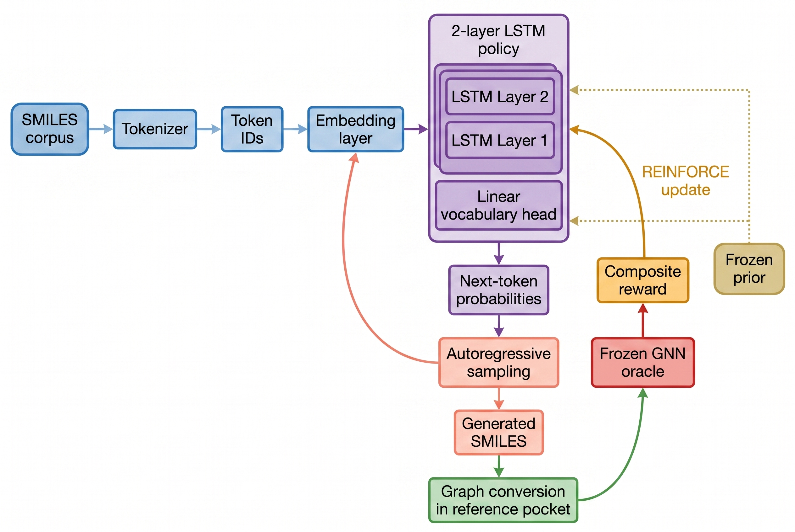
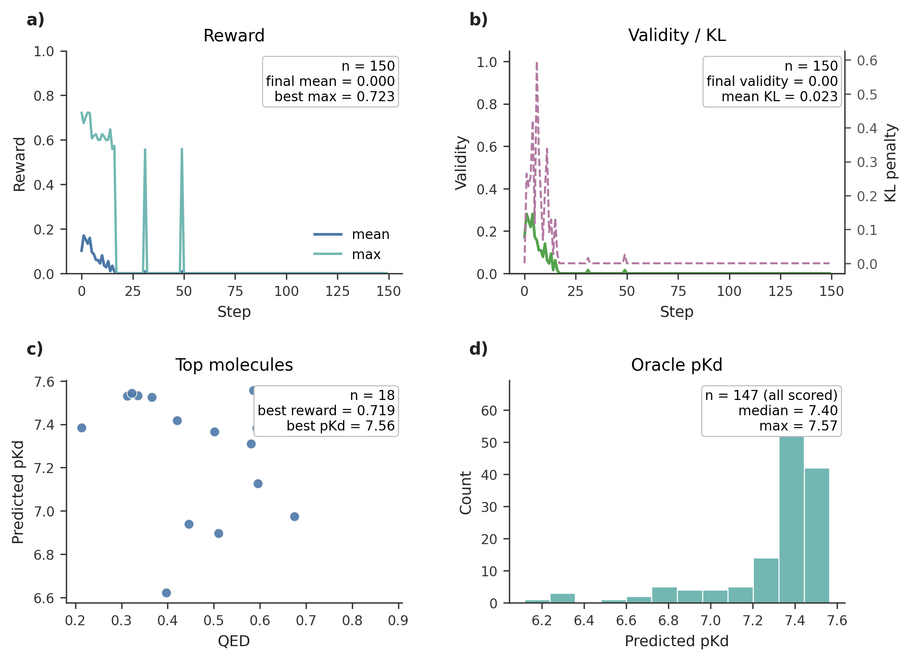
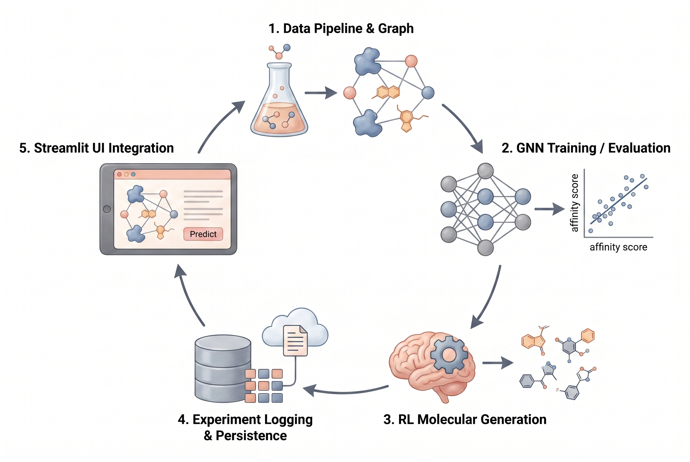

# GNNBindOptimizer — Architecture

## 1. Dataset & Graph Construction

### Dataset
PDBbind v2020 refined set, filtered to 150 protein–ligand complexes with measured pKd values.



*Fig 1. Dataset statistics (n=150). a) pKd distribution — mean 6.4, range 2.0–11.9. b) Ligand molecular weight — mean 380 Da, majority below 500 (Lipinski compliant). c) Pocket residue count — mean 27, range 9–43. d) Protein–ligand interaction edge count per complex — mean 27, long tail to 94.*

### Why a heterogeneous graph?
Protein-ligand binding involves two chemically distinct entity types (amino acid residues and small-molecule atoms) with fundamentally different feature spaces. A homogeneous GNN would require padding both to the same dimensionality, discarding the structural distinction. A heterogeneous graph preserves it natively and lets message-passing attend separately to intra-ligand, intra-pocket, and cross-interface edges.

### Node features
| Node type | Dim | Key features |
|-----------|-----|-------------|
| `ligand`  | 28  | atomic number (one-hot 11), degree (one-hot 6), hybridization (one-hot 5), formal charge, radical electrons, H count, aromaticity, ring membership |
| `residue` | 26  | amino-acid type (one-hot 21), backbone φ/ψ (sin/cos → 4 values), Kyte–Doolittle hydrophobicity |

### Edges
| Edge type | Rule | Features |
|-----------|------|----------|
| `bond` (lig→lig) | RDKit bonds | bond type (one-hot 4), conjugated, ring, stereo |
| `contact` (res→res) | Cα–Cα < 8 Å | Euclidean distance |
| `interacts` (lig→res) | any heavy-atom pair < 5 Å | distance, H-bond donor/acceptor flags |
| `interacts_rev` (res→lig) | reverse of above | same |

The 5 Å interaction cutoff captures direct van-der-Waals and electrostatic contacts without pulling in distant residues that contribute little to binding energetics.

---

## 2. GNN Architecture — HeteroGNN (HGTConv)



*Fig 2. HeteroGNN pipeline. Ligand atom graph and protein pocket residue graph are encoded together through 4 stacked HGTConv layers. Type-specific attentional pooling produces one embedding per modality; these are concatenated and passed through a shared MLP trunk before splitting into three task heads.*

### Why Heterogeneous Graph Transformer (HGT)?
HGT uses type-specific attention heads and relation-specific key-query-value projections, making it the natural fit when node and edge types carry different semantics.

| Architecture | Pros | Cons |
|---|---|---|
| HGTConv (chosen) | Type-aware attention; handles asymmetric feature dims natively | Higher compute than homogeneous GCN |
| HANConv | Metapath-based, strong for few relation types | Requires manual metapath design |
| GATConv (homogeneous) | Simpler; proven on molecular tasks | Loses protein/ligand distinction |
| SchNet/DimeNet | Explicit 3D geometry | Requires high-quality docked poses; fragile to conformer errors |

### Architecture details
- 4 × `HGTConv` layers, hidden dim 128, 4 attention heads
- Residual connections after each layer (add + LayerNorm)
- Global readout: type-specific attentional pooling → concatenate → 2-layer MLP trunk
- **3 prediction heads** (multi-task):

| Head | Task | Loss |
|------|------|------|
| `affinity_head` | scalar pKd regression | Smooth-L1 |
| `pose_head` | binary: RMSD < 2 Å | BCE |
| `selectivity_head` | binary: EGFR vs ABL1 | BCE |

### MTL vs STL results



*Fig 3. Test-set parity plots (n=15). a) MTL: RMSE=1.702, MAE=1.492. b) STL (affinity-only): RMSE=1.683, MAE=1.281. At n=150 the difference is within noise — STL shows marginally lower error on this split. MTL is expected to gain at larger dataset sizes where auxiliary supervision regularizes the shared encoder more effectively.*

### Why multi-task learning?
Pose quality and selectivity act as auxiliary signals sharing representations with the affinity prediction path. At 150 samples the benefit is marginal (MTL RMSE 1.702 vs STL 1.683); the expected benefit emerges at 5000+ complexes where the auxiliary heads act as regularizers.

**Uncertainty weighting (Kendall et al., 2018):** Each loss term is divided by a learned task variance σ² (log σ² is the actual parameter for numerical stability). This avoids manually tuning loss weights and lets the model adaptively balance tasks during training.

---

## 3. RL Molecular Generator



*Fig 4. REINFORCE training loop. SMILES corpus → character-level tokenizer → embedding → 2-layer LSTM policy → autoregressive token sampling → generated SMILES → 3D graph construction in reference pocket (6E9A) → frozen GNN oracle scores pKd → composite reward (affinity + QED + SA + MW) → REINFORCE gradient update. KL penalty against frozen prior (dashed) prevents mode collapse.*

### Why REINFORCE over PPO/GRPO?
For small-molecule generation, REINFORCE with an EMA baseline is computationally lighter and easier to interpret. PPO adds a value-network head and clipping mechanics that provide marginal benefit at this scale. Mode collapse is addressed via the KL-divergence penalty against the frozen prior.

### Policy: Character-level LSTM
- 2 layers, hidden dim 512, embedding dim 128
- Token vocabulary: single characters + two-char tokens (Cl, Br, @@, ...) → 37 tokens
- Pre-trained for 120 epochs on ~154 SMILES (PDBbind training ligands + 29 known EGFR inhibitors) using teacher-forcing cross-entropy

### Critical implementation note — eval mode during sampling
The LSTM must run in `eval()` mode during autoregressive generation. In `train()` mode, inter-layer dropout fires at every token step; compounded over 120 autoregressive steps this collapses SMILES validity to ~0%. Gradients flow through `log_p.gather()` regardless of train/eval state — REINFORCE backward is unaffected.

### Why character-level over fragment-based?
Character-level is simpler and produces more diverse output without requiring a curated fragment library. The trade-off is lower initial validity; fragment-based generators (REINVENT 4, GraphINVENT) achieve higher validity natively but are more complex to set up.

### Reward function
```
R = 0.5·r_affinity + 0.2·r_qed + 0.2·r_sa + 0.1·r_mw
```
| Component | Rationale |
|---|---|
| `r_affinity` | Normalized GNN pKd — primary optimization target |
| `r_qed` | Drug-likeness (Bickerton 2012) — composite Lipinski compliance |
| `r_sa` | 1 − SA_score/10 — synthetic accessibility (Ertl & Schuffenhauer) |
| `r_mw` | 1 if MW ≤ 500, linear penalty above — hard Lipinski MW filter |

Affinity weight (0.5) deliberately dominates to bias toward high-affinity molecules; QED and SA prevent convergence on synthetically inaccessible structures.

### RL results



*Fig 5. RL training summary (150 steps, batch 64, prior 60 epochs, reference pocket 6E9A pKd=11.92). a) Reward dynamics — mean and max per step. b) Validity and KL penalty vs frozen prior. c) Top generated molecules: QED vs predicted pKd scatter. d) Oracle pKd distribution over reward-ranked valid molecules. The full RL run sampled 9,600 SMILES, collected 280 valid molecules, and saved the top 18 reward-ranked molecules.*

**Summary (from `data/rl_results/rl_results.json`):**

| Metric | Value |
|--------|-------|
| Total sampled SMILES | 9,600 |
| Valid molecules collected | 280 |
| Full-run validity | 2.9% |
| Top molecules saved | 18 |
| Best reward | 0.719 |
| Best predicted pKd | 7.59 |
| Prior epochs | 60 |
| RL steps | 150 × 64 batch |

### How to read the RL curves

The RL x-axis is **training step**, not supervised-learning epoch. Each step samples a batch of 64 SMILES, computes reward, and applies one REINFORCE update.

- **Mean reward** shows batch-level policy quality. A sustained rise means the policy is generating better molecules more consistently.
- **Max reward** shows the best molecule in a batch. Spikes are useful hits, but they are weaker evidence if mean reward and validity stay low.
- **Validity** must be read together with reward. Low validity means many sampled strings are chemically invalid, so the reward signal is sparse and unstable.
- **KL penalty** measures drift from the frozen prior. A rising KL with falling validity suggests the policy is leaving the chemically learned prior too aggressively.

In the observed cold-start run, the policy found a best predicted pKd near 7.59, but later batches collapsed to very low validity and reward near zero. This makes the RL stage a working proof of concept rather than a production-grade molecular generator.

### Oracle: frozen GNN as proxy scorer
Generated SMILES → ETKDG 3D conformer → centroid alignment to reference pocket → GNN predicts pKd. **Limitation:** ETKDG + rigid centroid alignment is a coarse approximation of docking. A production system would call AutoDock Vina or FEP+ for scoring. The GNN oracle is used here as a fast differentiable proxy consistent with the exercise scope.

---

## 4. SQL Server Schema Design

Five tables capture the full experimental lifecycle:

| Table | Purpose |
|---|---|
| `experiments` | Configuration registry (JSON blob) — one row per experimental condition |
| `model_runs` | Per-epoch metrics from PyTorch Lightning training |
| `binding_predictions` | On-demand predictions from Streamlit UI |
| `rl_molecules` | All generated molecules with per-component reward breakdown |
| `vina_benchmarks` | GNN vs Vina correlation on held-out set |

**Why SQL Server?** The exercise specification required it. For a pure research workflow, PostgreSQL or DuckDB would suffice. SQL Server 2022 Express handles the dataset sizes here without issue.

**MLflow backend:** MLflow stores run metadata in a dedicated `mlflowdb` database (separate from `gnnbind`) to avoid schema conflicts — MLflow auto-creates its own `experiments` table with a different primary-key convention than `dbo.experiments`. The server uses `MLFLOW_BACKEND_STORE_URI=mssql+pyodbc://.../mlflowdb`, while trainer, RL, and UI clients use `MLFLOW_TRACKING_URI=http://mlflow:5000`. This separation is important: metrics still persist to SQL Server, and artifacts route through the MLflow server artifact proxy into the `mlflow_artifacts` Docker volume.

**Backfilling MLflow from existing checkpoints:** `scripts/log_existing_runs.py` reads checkpoint filenames (regex on `epoch=N-val_rmse=X`) and TensorBoard `lightning_logs/` events to reconstruct per-epoch convergence curves (`val_rmse`, `val_pearson_r`, `val_auc_pose`, `train_loss`) as MLflow step metrics. This enables convergence graphs in the MLflow UI without re-running training.

---

## 5. Docker Compose Service Topology

### Full pipeline




*Fig. Overview of the pipeline.*

Observed cold-start behavior:

1. `sqlserver` starts SQL Server 2022 and initializes `gnnbind` plus `mlflowdb`.
2. `mlflow` starts MLflow 2.12.1 on `http://localhost:5000`.
3. `gnn-trainer` executes notebooks 01 and 02, then exits with status 0.
4. `rl-agent` waits for trainer success, executes notebook 03, logs live metrics to MLflow, writes RL outputs, then exits with status 0.
5. `streamlit` remains up on `http://localhost:8501`.

The verified cold-start run produced three MLflow runs in experiment `gnn_bind_optimizer`: `gnn_mtl`, `gnn_stl`, and `reinforce_rl`. During RL training, MLflow showed `reinforce_rl` as `RUNNING` and metric histories (`reward_mean`, `validity`, `pg_loss`, `kl_penalty_mean`) updated live.


### Dry-run (pre-trained checkpoints)

```bash
docker compose up -d sqlserver mlflow streamlit
python scripts/log_existing_runs.py
```

Skips `gnn-trainer` and `rl-agent`. MLflow is populated from existing checkpoints and TensorBoard logs via the backfill script. Streamlit reads `checkpoints/` and `data/rl_results/rl_results.json` from volume mounts.

### ARM64 / Apple Silicon notes

- ODBC driver: apt source uses `$(dpkg --print-architecture)` — resolves to `arm64` on Apple Silicon instead of hardcoded `amd64`
- PyG: on Apple Silicon / Linux ARM64, `torch-scatter`, `torch-sparse`, and `torch-cluster` may compile from source because prebuilt wheels are not always available. This is the largest first cold-start cost.
- Docker image hygiene: `.dockerignore` excludes `data/`, `checkpoints/`, and `graphify-out/`; these are mounted at runtime instead of copied into images.
- Training runs on CPU (`MPS` not used — `scatter_reduce` unsupported on MPS backend).

---

## 6. Streamlit UI Design

Five pages, dark glassmorphism design (Space Grotesk + Instrument Serif, warm cream / deep teal palette):

| Page | Content |
|------|---------|
| **Summary** | KPI cards (RMSE, Pearson r, Pose AUC, best pKd), 3-phase project cards, MTL vs STL bar chart, RL reward curve (mean + max) |
| **Binding Predictor** | SMILES input → GNN inference → pKd, pose probability, selectivity metric cards + 2D structure |
| **RL Generator** | Dynamic pocket chip (⬡ Pocket 6E9A · pKd 11.92), card grid of top 18 molecules (structure SVG, pKd, QED, reward) |
| **GNN vs Vina** | Live GNN inference on RL top molecules → Meeko PDBQT prep → AutoDock Vina docking → parity scatter + table. Defaults to 10 molecules because Vina is slower than the GNN oracle. |
| **SQL Console** | Free-text SELECT → result table + CSV download |

Header badge is dynamic — reads `ref_pocket` and `ref_pkd` from `rl_results.json` at startup.

Post-run UI verification:

- Summary, Binding Predictor, RL Generator, GNN vs Vina, and SQL Console all render in Streamlit.
- SQL Console connects to SQL Server and the default read-only query returns rows.
- MLflow UI renders the three cold-start runs under `gnn_bind_optimizer`.
- Browser console showed Vega/Altair warnings for empty chart extents, but no blocking UI errors.

---

## 7. Limitations & Future Work

1. **Dataset size (150 samples):** PDBbind refined set filtered to 150 for speed. Production training would use 5000+ complexes with cross-validation across protein families. MTL benefit over STL is expected to be more pronounced at that scale.
2. **Oracle fidelity:** The RL loop still uses the fast frozen GNN oracle, while the Streamlit comparison page can now run AutoDock Vina post hoc for top generated molecules. A production RL loop would call AutoDock Vina or FEP+ during scoring rather than only for comparison.
3. **SMILES generator validity:** The observed full-run validity is low (280 valid molecules from 9,600 sampled SMILES; 2.9%). This is expected for a small character-level SMILES policy under sparse REINFORCE reward. SELFIES, a fragment-based generator, larger chemical pretraining, and explicit validity shaping would improve robustness.
4. **Selectivity labels:** Binary EGFR/ABL1 selectivity head uses synthetic labels derived from known inhibitor annotations. Real selectivity data would require paired kinase assay results.
5. **No 3D equivariance:** HGTConv is not SE(3)-equivariant. Switching to DimeNet++ or EGNN would improve geometric fidelity for affinity prediction.
6. **MLflow convergence curves (dry-run):** `log_existing_runs.py` reconstructs curves from TensorBoard events; step alignment is approximate (per-batch train steps bucketed by epoch tag). Live training logs directly to MLflow with exact step correspondence.
